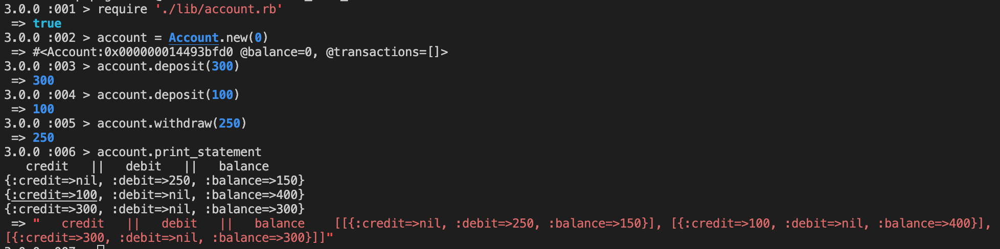

### Intoduction

  This is a tech test for a Bank Account as part of an exercise in the Makers Academy Bootcamp. By using this small program a client can create a bank account and carry out these transactions; desposit, withdraw and print statement.

### Setup the program

  In order to run these program the developers need to install the dependencies that are
included in the gemfile, by running the command 'bundle install' in their terminal, while being inside the program's directory.   
  

### Run the program

  The program is designed to work in the IRB. When inside the program's directory 
you can run it by typing the keyword 'irb' in the terminal to open the REPL. First the files that are included in the lib folder must be required with the 'require' keyword and the files' path in single quotemarks (''). After that, the developer is free to interact with the program.

### Test the program

  The gem that is used to test the program is RSpec. In order to test it the developer
simply needs to run the 'rspec' command in their terminal while being in the main path of the program's directory. If all tests pass, the program should be running fine.

### Demonstration
  
  The program is not yet finished as the date that each transaction is performed is not implemented, but this 
will be added in the near future. The print statement is not at its final stage as well, as it need to be improved and show just the number (amount), not their type and the 'nil' value should not be displayed. Currently the print statement looks like this;

